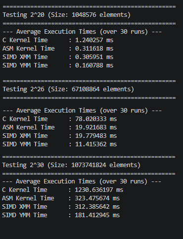
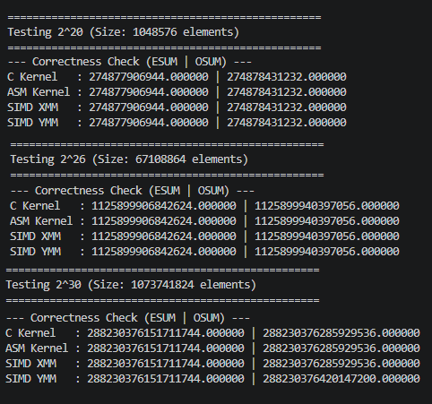
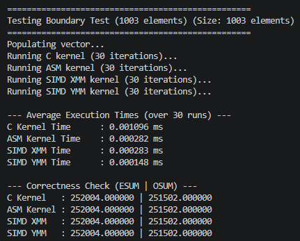

# SIMD Project 
## Input 
We are using the example input outlined in the specifications document. </br>
```
for (i = 0; i < n; i++){
    B[i] = i+1;
}
```

## Results 
### Execution time for all cases  </br>


### Correctness check for all cases  </br>


### Comparative Table
|Vector Size|C (ms)         |x86-64 (ms)| SIMD XMM (ms) |  SIMD YMM (ms)| 
| --------- | --------      | --------  | --------      | --------      |
| 2^20      | 1.240257      | 0.311618  | 0.305951      | 0.160788      |
| 2^26      | 78.020333     | 19.921683 | 19.779483     | 11.415362     |
| 2^30      | 1230.636197   | 323.475674| 11.415362     | 181.412945    |
#### Analysis 

### Boundary Check


### Discussion
## Authors
Kaizen Edwin Rodriguez </br>
Frances Danielle Solis
